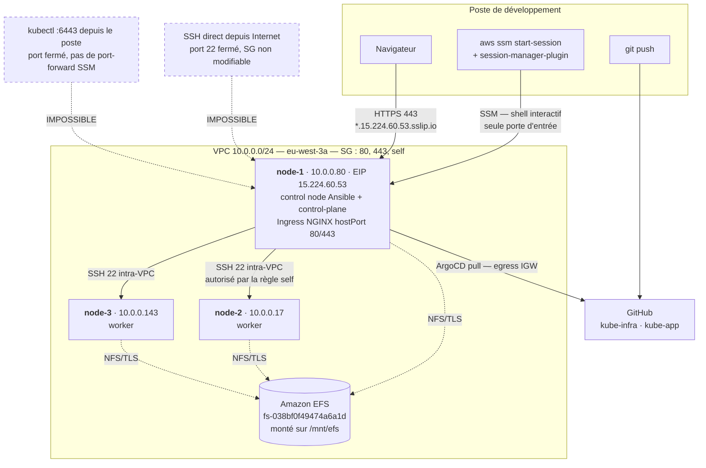
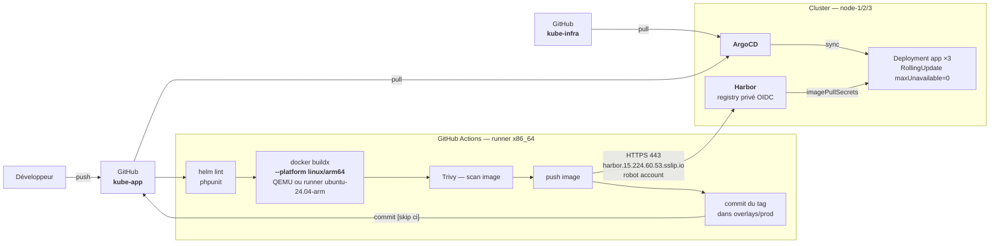
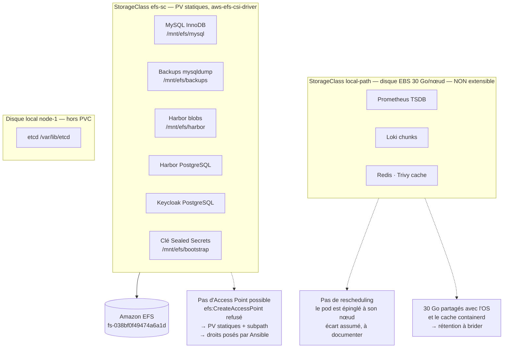

# Contraintes réelles du compte AWS — et comment livrer malgré elles

> Document transverse. Il ne remplace pas D1–D7 : il donne, **exigence par exigence**,
> la manière de faire compatible avec les droits réellement accordés au rôle
> `kubequest2-student`. Tous les droits listés ici ont été **vérifiés par appel API**,
> pas déduits d'une documentation.
>
> Compte `434352151741` · région `eu-west-3` · groupe 07 · relevé du 2026-09-21

---

## 1. Les six contraintes dures

| # | Contrainte | Conséquence directe |
|---|---|---|
| C1 | **Aucun accès SSH depuis l'extérieur** : port 22 fermé, security group non modifiable, aucune key pair sur le compte | Ansible ne peut pas tourner depuis un poste de dev → **node-1 devient le control node** (§4) |
| C2 | **`ssm:StartSession` limité au document par défaut** : pas de port-forwarding, pas de tunnel SSH, `ssm:SendCommand` refusé | Pas de `kubectl` depuis le poste de dev. Tout passe par l'Ingress (443) ou par une session sur le nœud |
| C3 | **Aucun droit de création AWS** : ni S3, ni IAM, ni EFS Access Point, ni security group, ni volume | Terraform inutilisable (confirmé). Le provisioning EFS doit être **statique** (§6) |
| C4 | **Architecture `arm64`** (t4g.medium) | Toute image applicative doit être construite pour `linux/arm64` (§5) |
| C5 | **1 seule AZ, 1 seul subnet** (`eu-west-3a`, 10.0.0.0/24) | Anti-affinité possible uniquement sur `kubernetes.io/hostname` |
| C6 | **30 Go de disque par nœud, non extensible** (`ec2:ModifyVolume` refusé) | Le stockage local est une ressource rare à budgéter (§6) |
| C7 | **L'EIP est immobile** : ni associable, ni détachable, ni libérable, et il n'en existe qu'une | node-1 est un SPOF structurel. Aucune HA possible, la reprise se fait par reconstruction (§7) |

Deux bonnes nouvelles qui tiennent le projet debout :

- **node-1 a une IP publique fixe** (EIP `15.224.60.53`) qui survit aux extinctions nocturnes → le domaine `sslip.io` et les certificats Let's Encrypt restent valides d'un jour sur l'autre.
- **Les 3 nœuds ont un accès Internet sortant** (subnet en `MapPublicIpOnLaunch=true`, route par IGW) → `dnf`, `helm pull`, `docker pull`, ArgoCD vers GitHub : tout passe.

### Correction à porter au README

| Point | README actuel | Réalité vérifiée |
|---|---|---|
| Connexion Ansible (§2.1 #1) | « inventaire statique + connexion via SSM » | Le plugin `aws_ssm` est inutilisable (S3 refusé, documents SSM bloqués) → bastion node-1 |
| Terraform (§2.1 #1b) | « risque d'échouer au `plan` faute de droits » | Le `plan` passe, c'est l'`apply` qui échoue sur **100 %** des ressources créables, y compris le périmètre EFS/IAM jugé « seul légitime » |
| Instances (§5 risque 8) | « 3× t3.medium » | `t4g.medium` = 2 vCPU / **4096 MiB**, soit exactement la même RAM. **Le budget de 12 Go bruts / ~9 Go utilisables reste valable.** La différence est l'architecture (arm64), pas la mémoire |

---

## 2. Matrice des droits (vérifiée par appel API)

### Autorisé

| Action | Usage dans le projet |
|---|---|
| `ec2:Start/Stop/RebootInstances` | Rituel d'allumage / extinction quotidien |
| `ssm:StartSession` (document par défaut) | **Seule porte d'entrée** sur les nœuds |
| `ec2:Describe*` (instances, SG, VPC, subnets, route tables, ENI, volumes, AMI, tags, IGW, endpoints) | Inventaire Ansible, documentation D3 |
| `ec2:GetConsoleOutput` | Debug de boot quand SSM ne répond pas |
| `ec2:CreateTags`, `ec2:CreateSnapshot` | Snapshot avant une manipulation risquée |
| `cloudwatch:ListMetrics`, `GetMetricStatistics`, `DescribeAlarms` | Métriques nœud en lecture seule |
| `ssm:GetConnectionStatus`, `DescribeInstanceInformation` | Vérifier qu'un nœud est joignable avant d'ouvrir une session |
| `ssm:DescribeSessions` | Lister les sessions — **mais pas les fermer**, `ssm:TerminateSession` est refusé : les sessions interrompues restent orphelines jusqu'à leur timeout |

### Refusé

`iam:*` · `s3:*` · `efs:*` · `eks:*` · `ecr:*` · `rds:*` · `lambda:*` · `kms:*` · `logs:*` · `cloudtrail:*` · `config:*` · `guardduty:*` · `securityhub:*` · `access-analyzer:*` · `organizations:*` · `secretsmanager:*` · `dynamodb:*` · `route53:*` · `elbv2:*` · `autoscaling:*` · `sso-admin:*`
`ssm:SendCommand` · `ec2-instance-connect:SendSSHPublicKey` · `ssm:StartSession` (documents SSH / port-forwarding / interactive-command)
`ec2:` CreateSecurityGroup · AuthorizeSecurityGroupIngress · CreateVolume · AttachVolume · ModifyVolume · ModifyInstanceAttribute · CreateImage · CreateVpc · AssociateAddress · TerminateInstances
`cloudwatch:PutMetricAlarm` · `cloudwatch:PutMetricData`

### Le rôle porté par les instances

Il existe un **second principal** dans ce compte, distinct de l'utilisateur SSO : le rôle
`kubequest2-group-07-ec2-role`, porté par le profil d'instance. C'est lui qui s'applique à
tout script exécuté sur un nœud. Son contenu n'est pas lisible (`iam:*` refusé), mais il se
sonde depuis une session SSM, **sans `--profile`** :

```
arn:aws:sts::434352151741:assumed-role/kubequest2-group-07-ec2-role/i-082cacf2f59f8ddd4
```

| Action testée depuis le nœud | Verdict | Conséquence |
|---|---|---|
| `ec2:AssociateAddress` | **UnauthorizedOperation** | Aucun failover d'EIP possible, même automatisé (§7) |
| `elasticfilesystem:DescribeFileSystems` | **AccessDeniedException** | Provisioning EFS **dynamique** impossible — le statique n'en dépend pas (§6) |

À retenir : ce rôle **n'est pas plus permissif** que l'utilisateur SSO sur les points testés.
Il porte vraisemblablement `AmazonSSMManagedInstanceCore` et de quoi monter l'EFS, rien de plus.

---

## 3. Exigence par exigence

Référencé sur la numérotation du README §2.

| # | Exigence | Impact des droits | Comment faire |
|---|---|---|---|
| 1 | Provisioning Ansible | **Fort** | Control node sur node-1, SSH intra-VPC vers node-2/3 (§4) |
| 1b | Terraform | **Écarté, confirmé** | Aucune ressource créable. La décision du README est la bonne, et la justification peut être chiffrée en soutenance |
| 2 | CNI Cilium | Aucun | eBPF ne dépend d'aucun droit AWS. Vérifier le kernel : **6.18 arm64**, largement suffisant |
| 3 | Ingress NGINX `hostPort` 80/443 | Aucun | Le SG autorise déjà 80 et 443 depuis `0.0.0.0/0`. Rien à ouvrir — et c'est heureux, tu ne pourrais pas |
| 4 | DNS `sslip.io` | Aucun | `*.15.224.60.53.sslip.io` — l'EIP est stable, `route53:*` refusé mais inutile |
| 5 | HTTPS Let's Encrypt HTTP-01 | Aucun | Port 80 déjà ouvert. Le challenge passe |
| 5b | PKI interne | Aucun | 100 % in-cluster |
| 6 | Dashboard Headlamp | **Moyen** (C2) | Aucun accès direct au 6443 → exposition **par l'Ingress obligatoire**, ce n'est plus un confort |
| 7 | kube-prometheus-stack | **Stockage** | TSDB Prometheus **pas sur EFS** (§6) |
| 8 | Loki + Alloy | **Stockage** | Idem, chunks en local-path (§6). `logs:*` AWS refusé : pas de repli CloudWatch, Loki est la seule source de logs |
| 9 | ArgoCD | Aucun | Egress Internet OK vers GitHub |
| 10 | Kustomize / App-of-Apps | Aucun | — |
| 11 | Registry privé | **Stockage + RAM** | Harbor = 4 PVC (blobs, Postgres, Redis, Trivy) + ~2 Go RAM. **Arbitrer tôt** (§6) |
| 12-13 | OIDC dex + Keycloak | **Moyen** (C2) | `kubectl` + `kubelogin` depuis le poste de dev **ne marchera pas** : le 6443 est injoignable. La démo OIDC `kubectl` se fait **depuis node-1**. À répéter, c'est un point noté |
| 14 | ValidatingAdmissionPolicy | Aucun | Natif k8s |
| 15 | Sealed Secrets | **Sauvegarde** | La clé privée se sauvegarde sur **EFS** (`/mnt/efs/bootstrap/`), qui survit à la destruction du cluster. Vrai bénéfice des droits dont tu disposes |
| 16 | Secrets vs ConfigMaps | Aucun | — |
| 17-19 | Requests/limits, labels, anti-affinité | **C5** | Anti-affinité sur `kubernetes.io/hostname` uniquement — une seule AZ, `topology.kubernetes.io/zone` n'a aucun sens ici. À dire en soutenance avant qu'on te le demande |
| 20 | Stockage EFS | **Fort** (C3) | `efs:CreateAccessPoint` refusé → **provisioning statique obligatoire** (§6) |
| 21 | MySQL Bitnami | **Fort** | Voir §6, c'est le point le plus délicat du projet |
| 22 | CronJob `mysqldump` | Aucun | Cible `/mnt/efs/backups` via PVC EFS |
| 23 | Deux repos GitOps | Aucun | — |
| 24 | Provisioning live en soutenance | **Moyen** | La démo se pilote **depuis une session SSM sur node-1**. Prévoir une fenêtre de terminal large et un `tmux` : une session SSM qui tombe coupe le playbook. `tmux` n'est pas un confort, c'est une assurance |
| 25-27 | GitOps, rollout, version fautive | Aucun | — |
| 28 | Preuves OIDC / HTTPS / admission | **C2** | (a) et (c) depuis node-1 ; (b) `curl -v` depuis n'importe où, le 443 est public |

---

## 4. Accès et déploiement

**Le principe** : node-1 est à la fois le control node Ansible, le control-plane Kubernetes et le point d'entrée HTTPS. C'est un point de défaillance unique assumé — la contrainte l'impose.



### Mise en place, une fois

1. **Poste de dev** — `aws sso login --profile kubequest2`, puis `brew install --cask session-manager-plugin`. Sans le plugin, `start-session` crée bien la session côté AWS puis échoue à l'ouvrir : l'erreur affichée porte trompeusement sur `TerminateSession`. Sur le poste, **toujours** `--profile kubequest2` ; dans la session SSM, **jamais** (les identifiants viennent d'IMDS).
2. **Démarrer les nœuds** — `aws ec2 start-instances --profile kubequest2 --instance-ids i-082cacf2f59f8ddd4 i-0f11f75585a35e303 i-03f48443ef76c0707`
3. **Ouvrir une session sur node-1** — `aws ssm start-session --profile kubequest2 --target i-082cacf2f59f8ddd4`, puis `sudo dnf install -y ansible-core git tmux`.
4. **Générer une clé sur node-1** et la déposer sur node-2 et node-3. Faute de `SendCommand` et d'`ec2-instance-connect`, c'est **une manipulation manuelle par nœud, via SSM** — 3 minutes, une seule fois. À scripter et documenter dans D2, c'est exactement le genre de détail que la soutenance cherche.
5. **Cloner `kube-infra` sur node-1** et lancer `ansible-playbook site.yml`.

Boucle de travail ensuite : `git push` depuis le poste → `git pull` dans la session SSM. Sans `s3:*` ni `SendCommand`, Git **est** le canal de transfert de fichiers.

---

## 5. CI/CD

Le point à ne pas rater : les runners GitHub sont **x86**, les nœuds sont **arm64**.



### Ce qui change à cause des droits

| Sujet | Décision |
|---|---|
| **Build arm64** | `docker/setup-qemu-action` + `buildx --platform linux/arm64`, ou runner `ubuntu-24.04-arm`. Le runner ARM est **3 à 5× plus rapide** que l'émulation QEMU sur un build `composer install` — à privilégier si le repo est public |
| **Runner auto-hébergé ?** | **Non.** Il consommerait la RAM du cluster, déjà comptée à ~7 Go sur 9. Les runners GitHub atteignent Harbor par le 443 public : ça suffit |
| **Accès CI → Harbor** | Robot account Harbor en secret GitHub. Aucun droit AWS requis (`ecr:*` est refusé de toute façon — et ECR serait hors sujet, le registry privé est imposé *dans* le cluster) |
| **Pas de cache de build distant** | `s3:*` refusé → pas de cache buildx sur S3. Utiliser le cache GitHub Actions (`type=gha`) |
| **Push du tag** | Le job qui `bump` le tag doit exclure le commit du déclenchement CI (`[skip ci]`), sinon boucle infinie |

---

## 6. Stockage — le vrai sujet

La majorité des composants imposés sont **stateful**. Et le sujet impose EFS, qui est du NFS, alors que plusieurs de ces composants s'y comportent mal.

### D'abord : EBS et EFS sont deux technologies différentes

La console ne montre que les volumes EC2 (EBS) — l'EFS y est invisible, parce que
`efs:DescribeFileSystems` est refusé. Une console vide ne prouve pas l'absence, elle prouve
l'absence de droit de lecture. L'EFS existe : son mount target est visible via l'API EC2
(`ENI eni-0d0a65d30cccc5a7f`, « EFS mount target for fs-038bf0f49474a6a1d », 10.0.0.145) et
le montage est **vérifié sur le nœud** (`127.0.0.1:/ nfs4 8.0E ... /mnt/efs`, via le tunnel
TLS d'efs-utils).

| | **EBS** — les « volumes » de la console | **EFS** |
|---|---|---|
| Nature | Disque bloc, comme un SSD branché | Système de fichiers réseau (NFS) |
| Attachement | **Une seule** instance à la fois | Les **3 nœuds** simultanément |
| Chez toi | 3 × 30 Go gp3 = les disques racine `/` | `fs-038bf0f49474a6a1d` sur `/mnt/efs` |
| Latence | ~0,5 ms | ~2 à 10 ms par opération |

Les deux StorageClasses ne sont que deux façons de donner ça à un pod :

| Critère | `local-path` (EBS) | `efs-sc` (EFS) |
|---|---|---|
| Access mode | `ReadWriteOnce` | `ReadWriteMany` |
| Le pod peut changer de nœud | **Non**, il est épinglé | **Oui** |
| Petites écritures synchronisées | Rapide | **10 à 100× plus lent** |
| Verrouillage POSIX (InnoDB, WAL) | Natif, fiable | NFSv4, fonctionne mais fragile |
| Capacité | **30 Go partagés** avec l'OS et les images | Élastique |
| Taille du PVC respectée ? | **Non**, aucun quota | Oui |
| Survit à la perte de l'instance | **Non** | Oui |
| Extensible | **Non** (`ec2:ModifyVolume` refusé) | Oui |

**Règle de décision : ce composant fait-il des `fsync` en continu sur de petits blocs ?**
Si oui → `local-path` ; un composant qui corrompt ses données n'est pas disponible, il est
cassé, et on perd plus de disponibilité que la mobilité n'en rend. Si non → `efs-sc`.

### Stockage partagé n'est pas redondance

Erreur de raisonnement fréquente : « tout sur EFS pour garder la redondance ». `efs-sc`
apporte la **mobilité** du pod, pas la redondance. On ne peut pas faire tourner deux MySQL,
deux Prometheus ou deux PostgreSQL écrivant dans le même répertoire : ces composants
restent mono-écrivain. Le `ReadWriteMany` ne les rend pas clusterables.

La redondance d'un composant stateful vient de la réplication applicative (réplication
MySQL, paire Prometheus HA, `replication_factor` Loki) — dont on ne déploie aucune ici, et
c'est le bon choix. Ce que `efs-sc` apporte réellement : la **durabilité** (EFS est répliqué
multi-AZ, un volume EBS ne l'est que dans une AZ) et le **temps de reprise**.

**La redondance que le sujet note est ailleurs** : exigences #19, #26 et #27 — l'application
à 3 replicas avec anti-affinité, le rolling update sans coupure, la version fautive qui ne
prend pas la main. L'application est stateless, elle n'a aucun PVC. Le choix de
StorageClass n'y change rien.

### Où va l'état de chaque composant

| Composant | État | Volume | Cible recommandée | Pourquoi |
|---|---|---|---|---|
| **MySQL** (app) | InnoDB | ~2 Go | **EFS** (imposé) | Exigence #20. Mitigations ci-dessous |
| **Backups `mysqldump`** | Dumps | ~1 Go | **EFS** | Usage idéal du NFS : écriture séquentielle, lecture rare, survit au cluster |
| **Harbor — blobs** | Layers d'images | ~5 Go | **EFS** | Blob store : fichiers entiers, peu de verrouillage. NFS convient bien |
| **Harbor — PostgreSQL** | Métadonnées | ~1 Go | **efs-sc** | Écritures rares. PostgreSQL est supporté sur NFS avec un montage `hard` — c'est le cas ici. La mobilité du pod vaut le coût |
| **Harbor — Redis / Trivy** | Cache | ~1 Go | **local-path** | Reconstructible, aucune valeur à déplacer |
| **Keycloak — PostgreSQL** | Users, realms, clients | ~500 Mo | **efs-sc** | Trafic très faible (quelques logins). **Ne pas laisser la base embarquée H2** : tu perds les realms au redémarrage |
| **Prometheus** | TSDB | ~5 Go | **local-path** | La doc Prometheus **exclut nommément EFS** : « NFS filesystems (including AWS's EFS) are not supported », risque de corruption irrécupérable du WAL |
| **Loki** | Chunks + index | ~2 Go | **local-path** | Même famille de problème |
| **Alertmanager / Grafana** | Silences, préférences | < 200 Mo | **local-path** | Dashboards provisionnés en ConfigMap → quasi stateless |
| **etcd** | État du cluster | ~1 Go | **disque local node-1** | Géré par kubeadm dans `/var/lib/etcd`. **Jamais** sur réseau |
| **Clé Sealed Secrets** | Clé privée | Ko | **EFS** `/mnt/efs/bootstrap/` | Survit à la destruction du cluster → répond au risque #6 |
| **ArgoCD, cert-manager, Cilium** | CRD / Secrets | — | **etcd** | Stateless au sens PVC |



### Provisioning EFS statique — la seule voie ouverte

`efs:CreateAccessPoint` étant refusé, le mode dynamique du driver (`provisioningMode: efs-ap`) est hors de portée. Il faut des **PV statiques par sous-répertoire**, ce qui fonctionne parfaitement et se documente bien :

```yaml
apiVersion: v1
kind: PersistentVolume
metadata:
  name: pv-mysql
spec:
  capacity: { storage: 8Gi }
  accessModes: [ReadWriteMany]
  persistentVolumeReclaimPolicy: Retain
  storageClassName: efs-sc
  csi:
    driver: efs.csi.aws.com
    volumeHandle: fs-038bf0f49474a6a1d:/mysql   # sous-répertoire, pas d'Access Point
```

Les droits UNIX que l'Access Point aurait posés doivent l'être **par Ansible**, depuis un nœud où `/mnt/efs` est déjà monté par le `userData` :

```yaml
- name: Arborescence EFS et droits (remplace les Access Points)
  file:
    path: "/mnt/efs/{{ item.d }}"
    state: directory
    owner: "{{ item.u }}"
    group: "{{ item.u }}"
    mode: "0750"
  loop:
    - { d: mysql,     u: 1001 }   # bitnami/mysql tourne en UID 1001
    - { d: backups,   u: 1001 }
    - { d: harbor,    u: 10000 }
    - { d: bootstrap, u: 0 }
  run_once: true
```

### Ce dont le driver a besoin — et ce qui est vérifié

`elasticfilesystem:DescribeFileSystems` est refusé **aux deux principals**, utilisateur SSO
comme rôle d'instance. Ce n'est pas bloquant : le montage EFS **ne passe pas par l'API**.
`amazon-efs-utils` résout `fs-038bf0f49474a6a1d.efs.eu-west-3.amazonaws.com` par DNS et monte
en NFS+TLS — ce que le `df` sur le nœud confirme. Seul le provisioning **dynamique**
(`CreateAccessPoint`, `DescribeAccessPoints`) est perdu, et il était déjà écarté.

Trois options, par ordre de préférence, à trancher au jour 1 :

| Rang | Solution | Dépendance API AWS | Remarque |
|---|---|---|---|
| 1 | **aws-efs-csi-driver**, PV statiques | Aucune en montage statique | À essayer d'abord : c'est la solution propre à présenter |
| 2 | **PV `nfs` natif** — `server: 10.0.0.145`, `path: /mysql` | **Aucune** | Aucun driver à installer, `ReadWriteMany` préservé. **Mais pas de TLS** : NFS en clair sur le port 2049, autorisé par la règle `self` du SG. Régression de sécurité à documenter |
| 3 | **PV `hostPath`** sur `/mnt/efs/<dir>` | **Aucune** | Réutilise le montage TLS déjà posé par le `fstab`, donc chiffré. Comme `/mnt/efs` est le même filesystem sur les 3 nœuds, on obtient un RWX de fait. Le moins élégant, le plus robuste |

Dans les trois cas les données atterrissent sur l'EFS : l'exigence #20 est satisfaite.

### MySQL sur EFS — mitigations

Le README assume déjà l'écart. Concrètement :

- `innodb_flush_method` : **laisser le défaut**, ne pas forcer `O_DIRECT` (mal supporté sur NFS)
- Une seule instance MySQL écrivant dans le répertoire — le mode `standalone` du chart Bitnami garantit ce point
- Monter avec l'option `noresvport` pour survivre aux reconnexions NFS
- **Tester dès la phase 1** : `mysqlslap` ou un simple `sysbench`. Si InnoDB refuse de démarrer sur verrouillage, le repli est `local-path` sur node-2, avec la sauvegarde `mysqldump` vers EFS comme garantie de durabilité — et un paragraphe honnête dans D3 et D6

### Budget disque — à surveiller

30 Go par nœud, **non extensible**. À déduire : OS (~3 Go) + images containerd (~8 Go avec Harbor, Keycloak, Prometheus). Il reste ~15 Go pour `local-path` par nœud. Donc :

- Prometheus : `retention: 7d` et `retentionSize: 4GB`
- Loki : `retention_period: 168h`
- `imageGCHighThresholdPercent: 75` sur le kubelet
- Une `PrometheusRule` sur `node_filesystem_avail_bytes < 15%` — un nœud plein passe en `DiskPressure` et évince les pods, c'est le mode de panne le plus probable de ce projet

---

## 7. Haute disponibilité : pourquoi il n'y en a pas

Question légitime : avec 3 nœuds, pourquoi pas un quorum ?

### Le quorum concerne etcd, pas les nœuds

C'est un mécanisme du protocole **Raft**, utilisé par etcd. Un worker n'a pas de voix.
Raft exige qu'une majorité stricte des membres soit vivante :

| Membres etcd | Quorum requis | Pannes tolérées |
|---|---|---|
| **1** | 1 | **0** |
| 2 | 2 | 0 |
| **3** | 2 | **1** |
| 5 | 3 | 2 |

D'où les nombres impairs : passer de 1 à 2 n'apporte rien. L'architecture retenue (README §3)
n'a **qu'un control-plane**, node-1 : un seul membre etcd, zéro panne tolérée.

### Ce qui se passe si node-1 tombe

| | État |
|---|---|
| Pods en cours sur node-2 / node-3 | **Continuent** — le kubelet est autonome |
| Pods qui étaient sur node-1 | Perdus, jamais reprogrammés |
| Scheduling, self-healing, rolling update, `kubectl` | Morts |
| **Accès extérieur** | **Mort** — l'EIP ne bouge pas |

### Pourquoi on ne peut pas faire mieux

Un control-plane empilé à 3 est techniquement possible — sans LB cloud, via un HAProxy local
sur chaque nœud devant les 3 apiservers. Coût : ~1,5 à 2 Go de RAM sur un budget de 9.

Mais ça ne sauverait rien, car **le point d'entrée public est immobile** :

| Approche | Verdict (vérifié) |
|---|---|
| NLB / ALB | `elbv2:CreateLoadBalancer` → AccessDenied |
| Déplacer l'EIP | `ec2:AssociateAddress` → UnauthorizedOperation **pour l'utilisateur SSO et pour le rôle d'instance** |
| Détacher / libérer l'EIP | `Disassociate` et `ReleaseAddress` → UnauthorizedOperation |
| Allouer une 2ᵉ EIP | `ec2:AllocateAddress` → UnauthorizedOperation (il n'en existe **qu'une** sur le compte) |
| VIP flottante (kube-vip, keepalived) en ARP | Impossible sur AWS : le VPC ne route que les IP déclarées sur une ENI |
| ASG + bascule automatique | `autoscaling:*`, `ec2:CreateLaunchTemplate`, `lambda:*`, `events:*` → tous refusés |
| Couper l'auto-assign d'IP publique | `ec2:ModifySubnetAttribute` → refusé. **Et ce serait nuisible** : sans NAT gateway (`CreateNatGateway` refusé aussi), node-2 et node-3 perdraient tout accès Internet sortant |

Tout l'édifice public repose sur `15.224.60.53` : le domaine `*.sslip.io`, les certificats
Let's Encrypt, l'Ingress en `hostPort`, et **dex, l'issuer OIDC déclaré à l'apiserver**. Un
etcd en quorum parfait sur un cluster que personne ne peut atteindre ne vaut pas 2 Go de RAM.

### La stratégie de reprise, c'est la reconstruction

Et c'est exactement ce que le sujet demande — *« torn down and rebuilt reproducibly »* :

1. `ansible-playbook site.yml` reconstruit le cluster en 10-15 min
2. ArgoCD redéploie tout depuis Git
3. Les données persistantes sont sur EFS, qui survit à la destruction des VM

**Réponse de soutenance** à « pourquoi pas de control-plane HA ? » : une seule AZ, aucun
load balancer autorisé, EIP non déplaçable par aucun principal, 12 Go de RAM. La HA aurait
coûté 2 Go pour protéger d'une panne dont le point d'entrée reste un SPOF. Avec les preuves
d'API à l'appui, c'est une meilleure réponse qu'une HA à moitié faite.

**Conséquence pratique** : node-1 étant irremplaçable, il garde etcd, l'apiserver et
l'Ingress, et rien d'autre. Prometheus, Loki, Harbor et MySQL vont sur node-2 et node-3.

---

## 8. Outils à ajouter

| Outil | Rôle | Pourquoi ici |
|---|---|---|
| **local-path-provisioner** (Rancher) | 2ᵉ StorageClass sur disque local | **La brique manquante du plan actuel.** Sans elle, Prometheus, Loki et les Postgres atterrissent sur NFS et deviennent instables. ~50 Mo de RAM, un seul manifeste |
| **`prowler kubernetes`** | Audit CIS Kubernetes — 92 checks, 7 services, référentiels `cis_2.0.1_kubernetes`, ISO 27001, PCI | Ne consomme **aucun droit AWS** : il parle au kube-apiserver. Un score avant/après durcissement alimente directement le bonus « renforcement réseau ». S'exécute depuis node-1 (C2). À l'inverse, `prowler aws` ne verrait que ~100 checks EC2 et **avalerait silencieusement** les `AccessDenied` sur tout le reste : un rapport global serait trompeur |
| **kube-bench** | Checks CIS au niveau fichier (permissions de `/etc/kubernetes`, kubelet) | Complément de Prowler sur les contrôles que l'API ne peut pas voir. DaemonSet, s'exécute et se termine |
| **tmux** sur node-1 | Persistance des sessions | Une session SSM qui tombe pendant `ansible-playbook site.yml` en soutenance = démo perdue. Non négociable |
| **`hey`** (plutôt que `vegeta`) | Preuve zéro-downtime (bonus) | Binaire Go unique, `GOARCH=arm64` disponible, s'exécute depuis node-1 |
| **`helm-diff`** + **`kubeconform`** | Pré-vol en CI | Complète `helm lint`, attrape les manifestes que la VAP refusera avant de les pousser |
| **`k9s`** sur node-1 | Navigation cluster en terminal | Sans dashboard accessible depuis le poste avant que l'Ingress ne soit debout, c'est le seul confort de debug de la phase 1 |

Explicitement **écartés** : Terraform (§1 C3), runner GitHub auto-hébergé (RAM), External Secrets et Vault (nécessitent un backend AWS refusé — Sealed Secrets reste le bon choix), `kubectl` + `kubelogin` depuis le poste de dev (C2).

---

## 9. Ce qui reste à vérifier en priorité

| Priorité | Question ouverte | Comment trancher |
|---|---|---|
| 1 | Le driver EFS CSI monte-t-il un PV statique ? | **Partiellement résolu** : l'API EFS est refusée aux deux principals, mais le montage n'en dépend pas et fonctionne déjà via le `fstab`. Reste à confirmer côté driver — sinon, options 2 et 3 du §6 |
| 2 | Toutes les images (Harbor, Keycloak, Cilium, kube-prometheus-stack) existent-elles en arm64 ? | `docker manifest inspect <image> \| grep arm64` sur chaque chart avant de bâtir dessus |
| 3 | InnoDB tient-il sur EFS ? | `mysqlslap` en phase 1, pas en phase 8 |
| 4 | Le budget RAM tient-il avec Harbor ? | `kubectl top nodes` après le déploiement d'Harbor. Sinon bascule Zot (#11) |
